# DevSecOps Pipeline — FastAPI + ECS Fargate + GitHub Actions

A production-style DevSecOps project that embeds five security gates into a
CI/CD pipeline deploying a FastAPI backend to AWS ECS Fargate.

## Architecture

```
git push
   │
   ├─ Gate 1: Gitleaks        — secret scanning on every commit
   ├─ Gate 2: Bandit           — Python SAST
   │          Semgrep          — broader SAST (OWASP Top 10 rules)
   │          pip-audit        — CVEs in PyPI dependencies
   ├─ Gate 3: Checkov          — Terraform IaC misconfiguration scan
   │
   ├─ Docker build → ECR push
   │
   ├─ Gate 4: Trivy            — container image CVE scan
   │
   ├─ Deploy → ECS Fargate (staging)
   │
   ├─ Gate 5: OWASP ZAP        — DAST against live staging endpoint
   │          (baseline + API scan)
   │
   └─ Deploy → ECS Fargate (production)  [main branch only]
```

All security tools upload SARIF reports to the GitHub Security tab.

## Stack

| Layer        | Technology                              |
|--------------|-----------------------------------------|
| Backend      | FastAPI (Python 3.11)                   |
| Container    | Docker (multi-stage, non-root user)     |
| Registry     | Amazon ECR                              |
| Compute      | Amazon ECS Fargate (private subnets)    |
| Networking   | VPC, ALB, NAT Gateway, multi-AZ        |
| IaC          | Terraform (modular)                     |
| Secrets      | AWS SSM Parameter Store (SecureString)  |
| CI/CD        | GitHub Actions                          |
| SAST         | Bandit, Semgrep                         |
| Dep scanning | pip-audit                               |
| IaC scanning | Checkov                                 |
| Image scan   | Trivy                                   |
| DAST         | OWASP ZAP (baseline + API)              |
| Secret scan  | Gitleaks                                |

## Project Structure

```
.
├── app/
│   ├── main.py                  # FastAPI app entry point
│   ├── routers/
│   │   ├── auth.py              # JWT login endpoint
│   │   └── items.py             # CRUD demo endpoints
│   └── middleware/
│       └── logging.py           # Request logging middleware
├── terraform/
│   ├── main.tf                  # Root module — wires everything together
│   ├── variables.tf
│   ├── outputs.tf
│   ├── modules/
│   │   ├── vpc/                 # VPC, subnets, NAT Gateway, route tables
│   │   ├── ecr/                 # ECR repository + lifecycle policy
│   │   ├── alb/                 # ALB, target group, listener, security group
│   │   ├── ecs/                 # ECS cluster, task definition, Fargate service
│   │   └── ssm/                 # SSM Parameter Store secrets
│   └── envs/
│       ├── staging/terraform.tfvars
│       └── production/terraform.tfvars
├── .github/workflows/
│   └── devsecops-pipeline.yml   # Full CI/CD + security gates
├── .zap/rules.tsv               # ZAP false-positive suppressions
├── .checkov.yaml                # Checkov policy overrides (justified)
├── Dockerfile                   # Multi-stage, non-root, health check
├── .dockerignore
└── requirements.txt
```

## Setup

### 1. AWS Prerequisites

```bash
# Create S3 bucket for Terraform state
aws s3 mb s3://devsecops-tfstate-YOUR_ACCOUNT_ID --region us-east-1
aws s3api put-bucket-versioning \
  --bucket devsecops-tfstate-YOUR_ACCOUNT_ID \
  --versioning-configuration Status=Enabled

# Create DynamoDB table for state locking
aws dynamodb create-table \
  --table-name devsecops-tfstate-lock \
  --attribute-definitions AttributeName=LockID,AttributeType=S \
  --key-schema AttributeName=LockID,KeyType=HASH \
  --billing-mode PAY_PER_REQUEST \
  --region us-east-1
```

### 2. GitHub Secrets

Add these in Settings → Secrets → Actions:

| Secret                    | Description                                      |
|---------------------------|--------------------------------------------------|
| `AWS_ACCESS_KEY_ID`       | IAM user access key                              |
| `AWS_SECRET_ACCESS_KEY`   | IAM user secret key                              |
| `JWT_SECRET_STAGING`      | `openssl rand -hex 32` — staging JWT secret      |
| `JWT_SECRET_PRODUCTION`   | `openssl rand -hex 32` — production JWT secret   |
| `SEMGREP_APP_TOKEN`       | semgrep.dev → Settings → Tokens                  |
| `SONAR_TOKEN`             | sonarcloud.io → My Account → Security            |

### 3. Deploy Infrastructure

Staging and production use separate state files — pass the state key via
`-backend-config` at init time so they never overwrite each other.

```bash
cd terraform

# Staging
terraform init \
  -backend-config="bucket=devsecops-tfstate-YOUR_ACCOUNT_ID" \
  -backend-config="key=devsecops/staging/terraform.tfstate" \
  -backend-config="region=us-east-1"

terraform apply \
  -var-file=envs/staging/terraform.tfvars \
  -var="jwt_secret=$env:JWT_SECRET_STAGING"   # PowerShell
  # -var="jwt_secret=$JWT_SECRET_STAGING"      # bash

# Verify staging is healthy before continuing
# → check AWS Console → ECS, hit the staging ALB /health endpoint

# Production
terraform init \
  -backend-config="bucket=devsecops-tfstate-YOUR_ACCOUNT_ID" \
  -backend-config="key=devsecops/production/terraform.tfstate" \
  -backend-config="region=us-east-1" \
  -reconfigure   # required when switching state backends

terraform apply \
  -var-file=envs/production/terraform.tfvars \
  -var="jwt_secret=$env:JWT_SECRET_PRODUCTION"   # PowerShell
  # -var="jwt_secret=$JWT_SECRET_PRODUCTION"      # bash
```

### 4. Push code to trigger pipeline

```bash
git add .
git commit -m "feat: initial deployment"
git push origin main
```

## Security Gates Reference

| Gate | Tool       | What it catches                              | Fails on        |
|------|------------|----------------------------------------------|-----------------|
| 1    | Gitleaks   | Secrets committed to git                     | Any secret      |
| 2    | Bandit     | Python insecure patterns (eval, subprocess)  | MEDIUM+         |
| 2    | Semgrep    | OWASP Top 10, JWT misuse                     | ERROR severity  |
| 2    | pip-audit  | CVEs in PyPI dependencies                    | Any CVE         |
| 3    | Checkov    | Terraform IaC misconfigurations              | HIGH+           |
| 4    | Trivy      | OS + library CVEs in Docker image            | HIGH/CRITICAL   |
| 5    | ZAP        | XSS, SQLi, auth bypass on live app           | WARN+           |

> Tip: tear down NAT Gateway and ALB when not actively testing to save credits.
> `terraform destroy` takes ~5 minutes and can be reapplied when needed.

---
## 📸 Screenshots
<p align="center">
    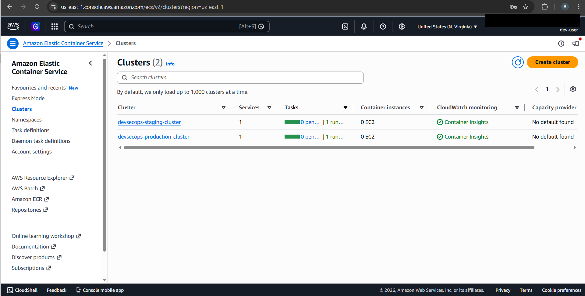
    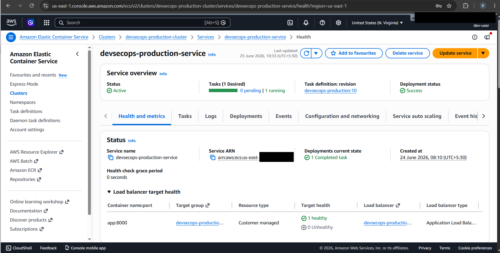
    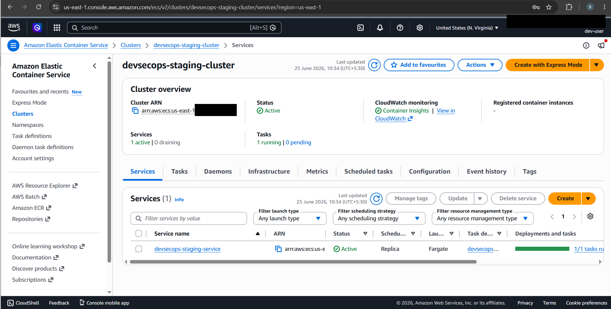
    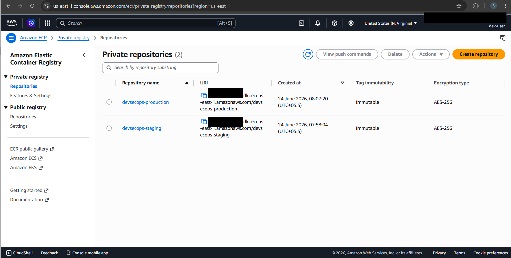
    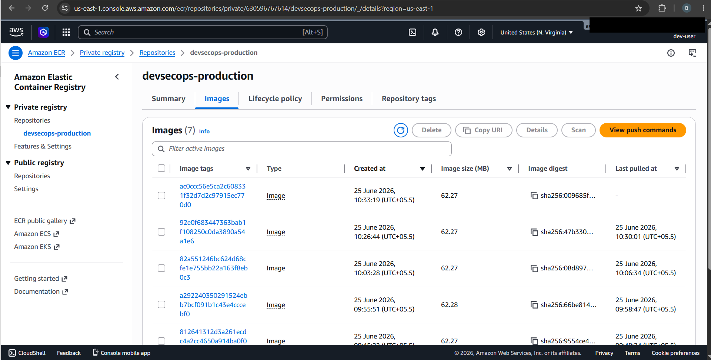
    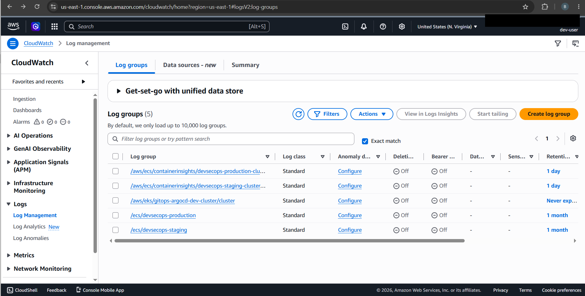
    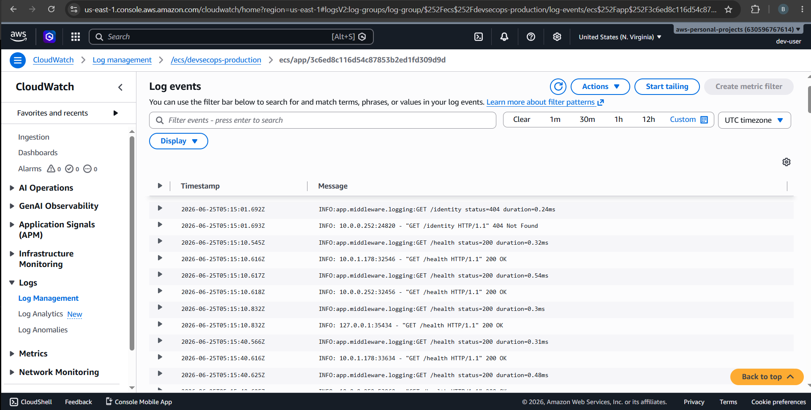
    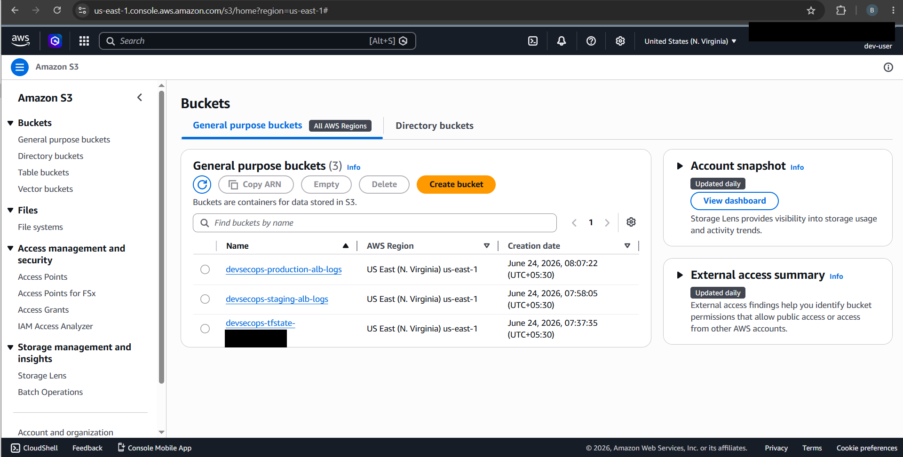
    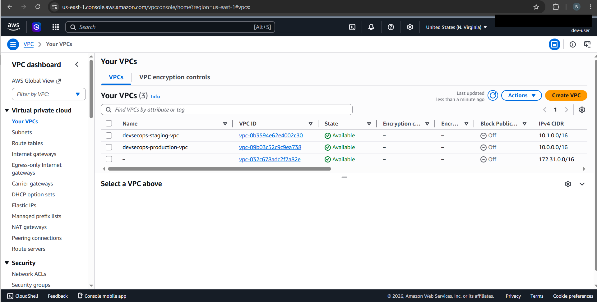
    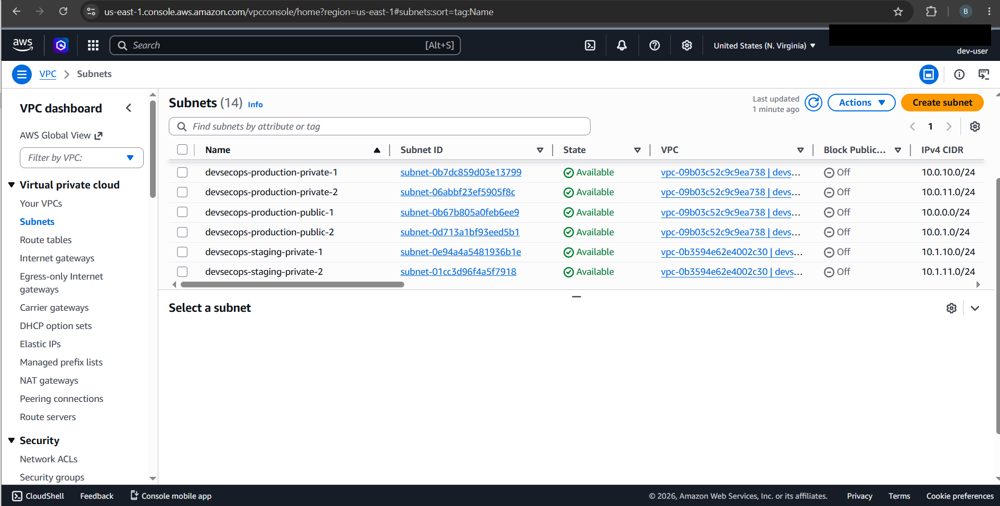
    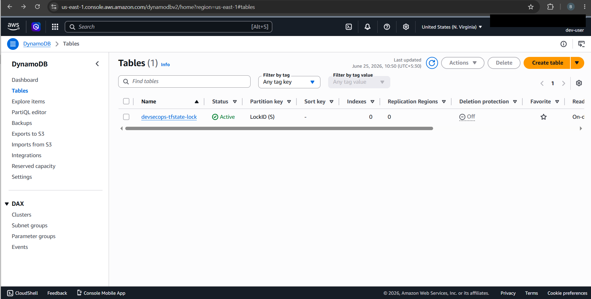
    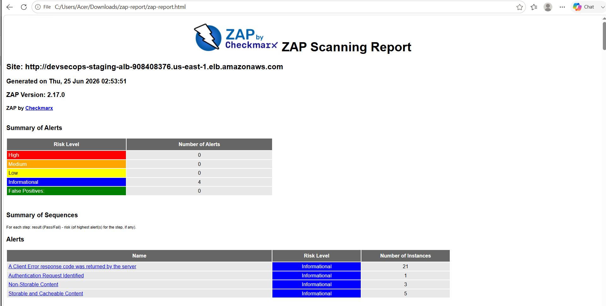
    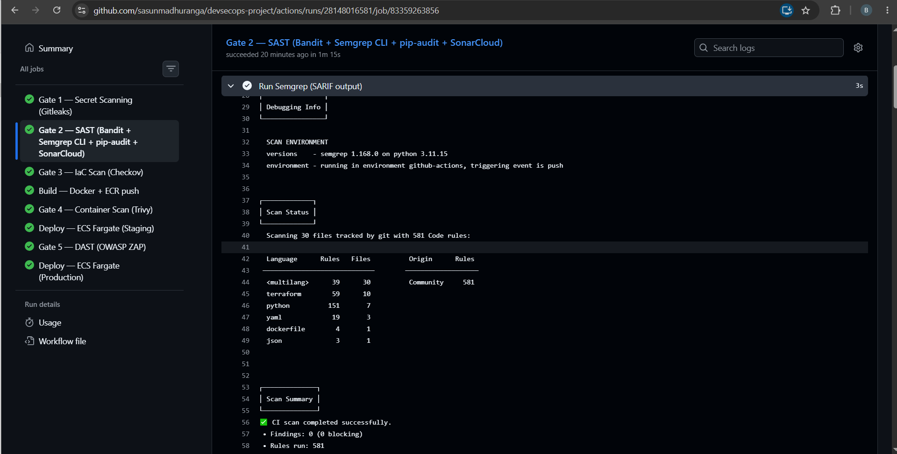
    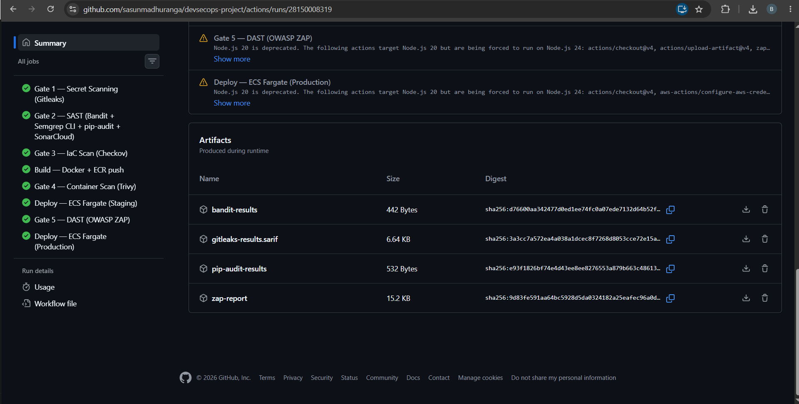
    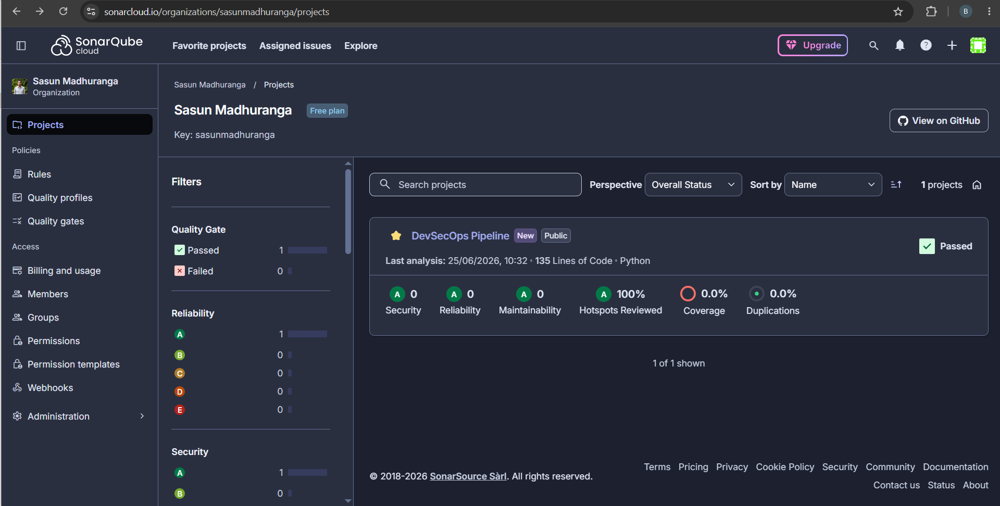
    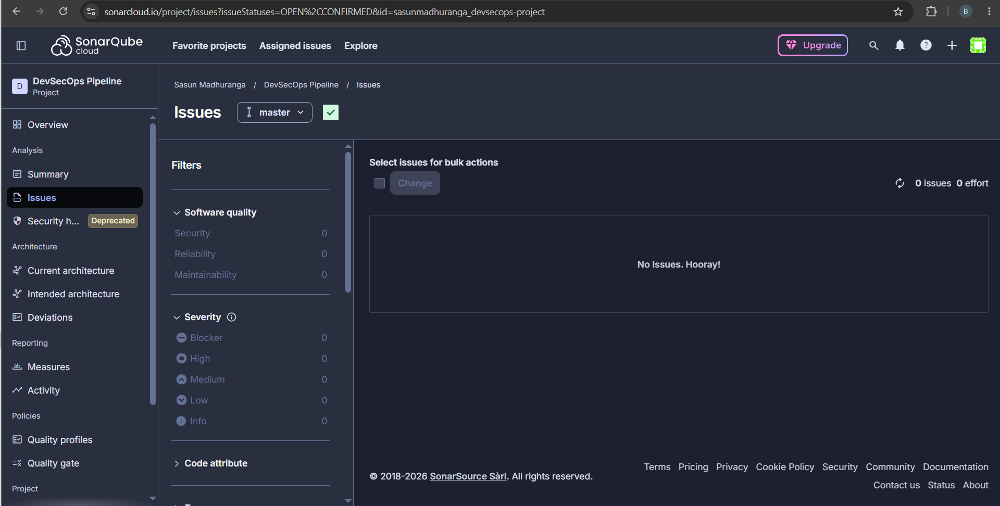
    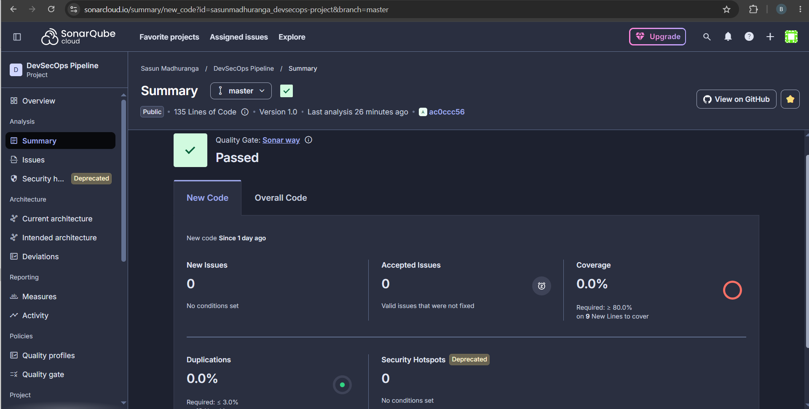
</p>

---

## Author
Sasun Madhuranga

GitHub: https://github.com/sasunmadhuranga
